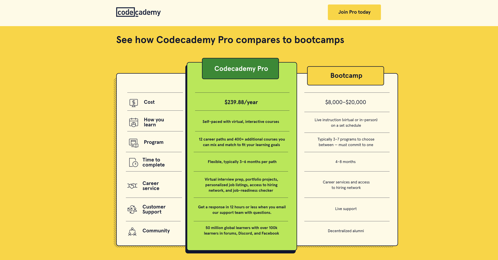
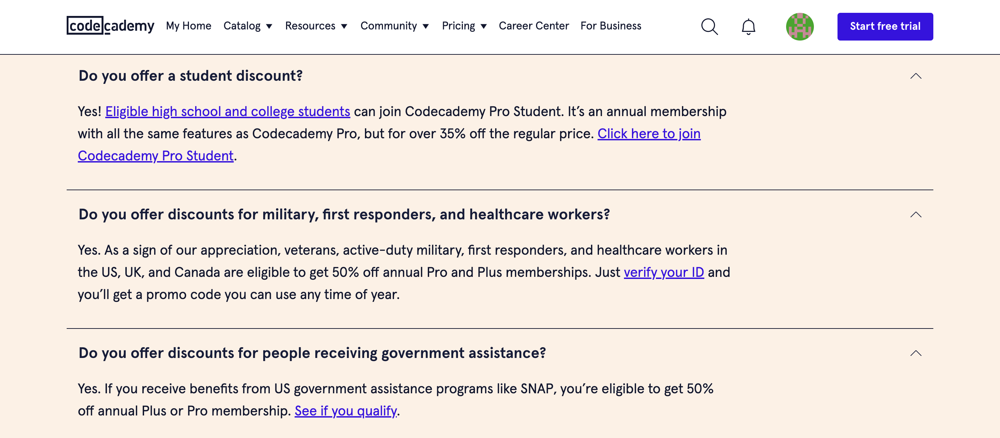

# Codecademy
 

From 2022 to present I have worked as a freelance copywriter for Codecademy, an interactive learning platform for people looking to grow their digital skills. 

I work closely with a creative team of designers and writers, as well as CRM, social media, and content leads, to develop ideas and copy for topical and evergreen emails, on-site copy, paid ads, and more.

My experience writing marketing and UX copy for Codecademy has allowed me to practice writing with precision and clarity, adhering to Codecademy’s brand style guide, and using problem solving skills to work with character limits and formatting constraints determined by digital marketing tools like Digioh, Instapage, and Stensul. 

 

 

ads
