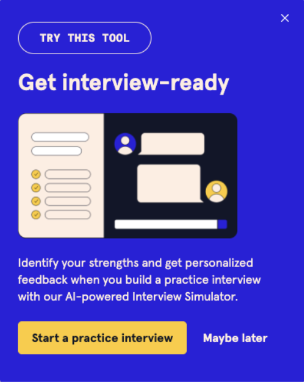

# Codecademy
 

From 2022 to present I have worked as a freelance copywriter for Codecademy, an interactive learning platform for people looking to grow their digital skills. 

I work closely with a creative team of designers and writers, as well as CRM, social media, and content leads, to develop ideas and copy for landing pages, on-site UX, emails, paid ads, and more.

My experience writing marketing and UX copy for Codecademy has allowed me to practice writing with precision and clarity. I use problem solving skills daily to work within character limits and formatting constraints determined by digital marketing tools like Digioh, Instapage, and Stensul. 

In addition to following Codecademy’s brand style guide, I worked with other writers to develop an up-to-date glossary of product features to ensure we write value propositions and product descriptions that are consistent and accurate.

