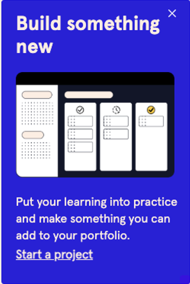

# Codecademy
 

From 2022 to present I have worked as a freelance copywriter for Codecademy, an interactive learning platform for people looking to grow their digital skills. 

I work closely with a creative team of designers and writers, as well as CRM, social media, and content leads, to develop ideas and copy for topical and evergreen emails, on-site copy, paid ads, and more.

My experience writing marketing and UX copy for Codecademy has allowed me to practice writing with precision and clarity, using my problem solving skills to work with character limits and formatting constraints determined by digital marketing tools like Digioh, Instapage, and Stensul. 

As I work with writers and marketers across multiple teams, it's important that we accurately and consistently describe our product and do so while adhering to our brand style guide. Together with the creative team, I helped develop a glossary of product features that we refer to regularly as we write new email newsletters, social posts, and onsite banners (to name just a few).
 

 

ads
